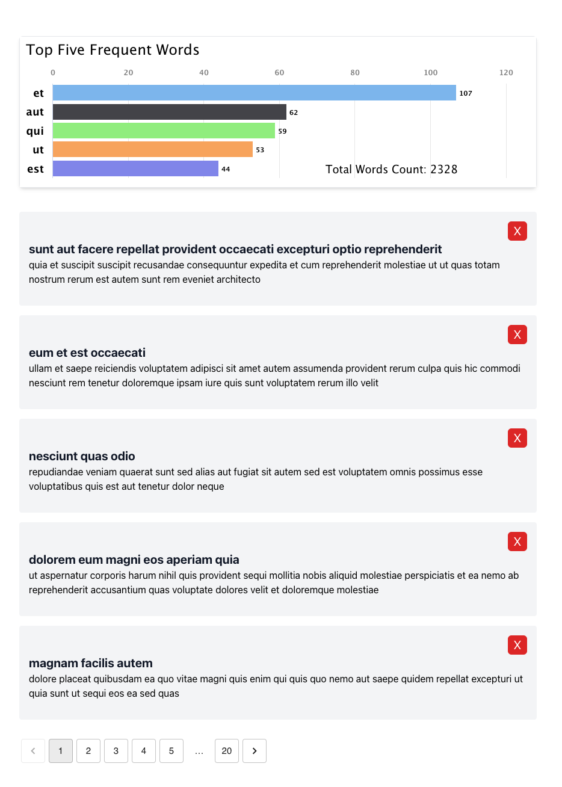

# Posts

This project was bootstrapped with Create React App.

Technology used:

- React
- Typescript
- Tailwind
- react-resting-library, Jest
- Redux Toolkit
- Material UI

## Project setup

- Clone down this repository
- Navigate to the project directory
- Install all dependencies run `npm i`

### `npm start`

Runs the app in the development mode.\
Open [http://localhost:3000](http://localhost:3000) to view it in the browser.

### `npm test`

Launches the test runner in the interactive watch mode.

### `npm run build`

Builds the app for production to the `build` folder.
